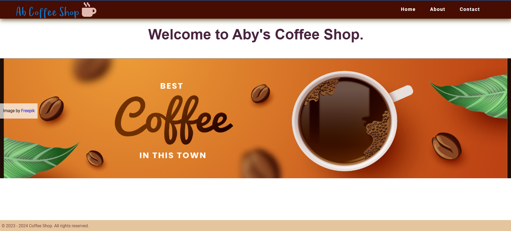

# hcj-only-topnavbar-footer

I am learning to create Top Navbar and Footer from different Video Courses, Books, and Websites

## Hosted URL

> 1. <https://microservices-sportsshop.github.io/hcjjs-3-topnavbar-footer/>

